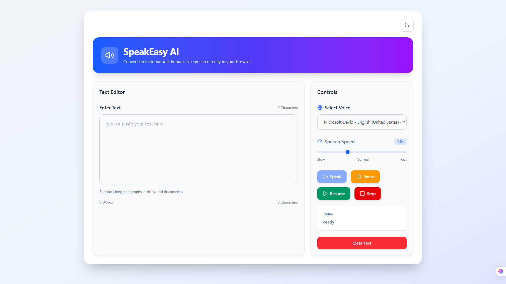
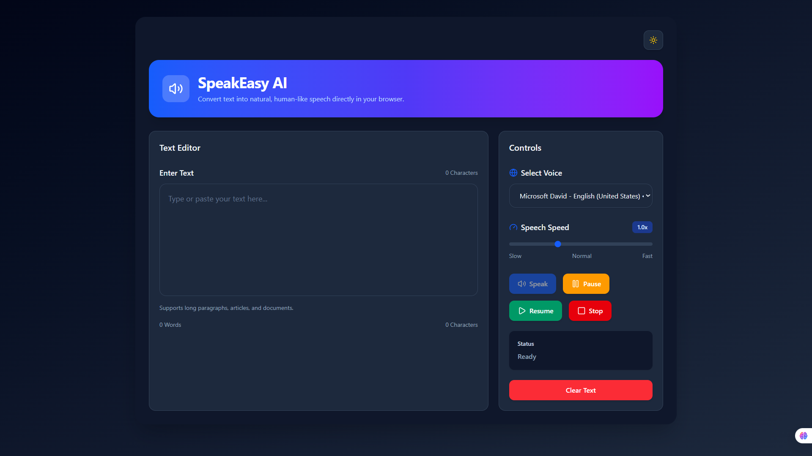

# React + TypeScript + Vite

This template provides a minimal setup to get React working in Vite with HMR and some ESLint rules.

Currently, two official plugins are available:

- [@vitejs/plugin-react](https://github.com/vitejs/vite-plugin-react/blob/main/packages/plugin-react) uses [Oxc](https://oxc.rs)
- [@vitejs/plugin-react-swc](https://github.com/vitejs/vite-plugin-react/blob/main/packages/plugin-react-swc) uses [SWC](https://swc.rs/)

## React Compiler

The React Compiler is enabled on this template. See [this documentation](https://react.dev/learn/react-compiler) for more information.

Note: This will impact Vite dev & build performances.

## Expanding the ESLint configuration

If you are developing a production application, we recommend updating the configuration to enable type-aware lint rules:

```js
export default defineConfig([
  globalIgnores(["dist"]),
  {
    files: ["**/*.{ts,tsx}"],
    extends: [
      // Other configs...

      // Remove tseslint.configs.recommended and replace with this
      tseslint.configs.recommendedTypeChecked,
      // Alternatively, use this for stricter rules
      tseslint.configs.strictTypeChecked,
      // Optionally, add this for stylistic rules
      tseslint.configs.stylisticTypeChecked,

      // Other configs...
    ],
    languageOptions: {
      parserOptions: {
        project: ["./tsconfig.node.json", "./tsconfig.app.json"],
        tsconfigRootDir: import.meta.dirname,
      },
      // other options...
    },
  },
]);
```

You can also install [eslint-plugin-react-x](https://github.com/Rel1cx/eslint-react/tree/main/packages/plugins/eslint-plugin-react-x) and [eslint-plugin-react-dom](https://github.com/Rel1cx/eslint-react/tree/main/packages/plugins/eslint-plugin-react-dom) for React-specific lint rules:

```js
// eslint.config.js
import reactX from "eslint-plugin-react-x";
import reactDom from "eslint-plugin-react-dom";

export default defineConfig([
  globalIgnores(["dist"]),
  {
    files: ["**/*.{ts,tsx}"],
    extends: [
      // Other configs...
      // Enable lint rules for React
      reactX.configs["recommended-typescript"],
      // Enable lint rules for React DOM
      reactDom.configs.recommended,
    ],
    languageOptions: {
      parserOptions: {
        project: ["./tsconfig.node.json", "./tsconfig.app.json"],
        tsconfigRootDir: import.meta.dirname,
      },
      // other options...
    },
  },
]);
```

/-------------------------------------------------------------------------------------------------------------------------------------------------------------------------

# 🔊 SpeakEasy AI

A modern **Text-to-Speech (TTS)** web application built with **React**, **TypeScript**, **Vite**, and **Tailwind CSS**. SpeakEasy AI converts written text into natural speech using the browser's built-in **Web Speech API**, while providing a clean, responsive interface with customizable voices, speech speed, and dark mode.

---

## 📸 Preview


### ☀️ Light Mode



---

### 🌙 Dark Mode



---

## ✨ Features

- 🔊 Convert text into speech instantly
- 🌍 Multiple voice selection
- ⚡ Adjustable speech speed
- ⏸ Pause, Resume and Stop controls
- 🌙 Light & Dark mode
- 📊 Live word counter
- 🔢 Live character counter
- 🧹 Clear text functionality
- 📱 Responsive design
- 🎨 Modern and clean UI
- ⚛️ Built with reusable React components
- 🪝 Custom React Hooks

---

## 🛠️ Tech Stack

| Technology     | Purpose                  |
| -------------- | ------------------------ |
| React          | Frontend Framework       |
| TypeScript     | Type Safety              |
| Vite           | Development & Build Tool |
| Tailwind CSS   | Styling                  |
| Lucide React   | Icons                    |
| Web Speech API | Text-to-Speech           |

---

## 📂 Project Structure

```text
src/
│
├── components/
│   ├── Header.tsx
│   ├── SpeechControls.tsx
│   ├── SpeedSlider.tsx
│   ├── TextInput.tsx
│   ├── ThemeToggle.tsx
│   └── VoiceSelector.tsx
│
├── hooks/
│   ├── useSpeech.ts
│   └── useTheme.ts
│
├── App.tsx
├── main.tsx
└── index.css
```

---

## 🚀 Getting Started

### Clone the repository

```bash
git clone https://github.com/YOUR_USERNAME/speakeasy-ai.git
```

### Navigate to the project

```bash
cd speakeasy-ai
```

### Install dependencies

```bash
npm install
```

### Run the development server

```bash
npm run dev
```

Open the URL shown in your terminal (usually `http://localhost:5173`).

---

## 🎯 Usage

1. Enter or paste text into the editor.
2. Choose a voice from the available options.
3. Adjust the speech speed.
4. Click **Speak**.
5. Pause, Resume, or Stop playback whenever needed.
6. Switch between Light and Dark mode using the theme toggle.

---

## 💻 Responsive Design

The application is fully responsive and works across:

- Desktop
- Laptop
- Tablet
- Mobile Devices

---

## 🔮 Future Improvements

- 📄 PDF to Speech
- 📥 Export speech as MP3
- 🌍 Language filtering
- 💾 Save user preferences
- 📋 Copy text to clipboard
- 📑 Drag & Drop document upload
- 🤖 AI-powered summarization
- 🌐 Text translation

---

## 📖 What I Learned

While building this project, I gained hands-on experience with:

- React Hooks
- Custom Hooks
- TypeScript
- Tailwind CSS
- Component-based architecture
- Responsive UI Design
- Theme Management
- Browser APIs
- State Management
- Clean Project Structure

---

## 🤝 Contributing

Contributions, issues, and feature requests are welcome.

If you have suggestions for improvements, feel free to open an issue or submit a pull request.

---

## 📄 License

This project is licensed under the MIT License.

---

## 👨‍💻 Author

**Ateeq Malkani**

If you found this project useful, consider giving it a ⭐ on GitHub.
